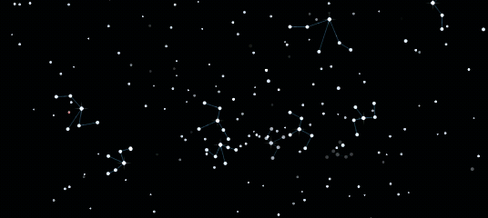
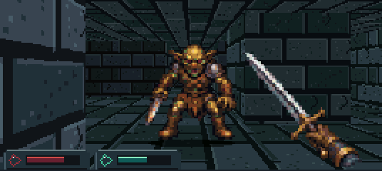
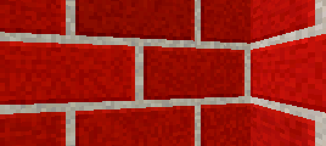
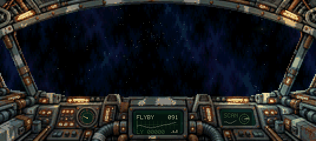
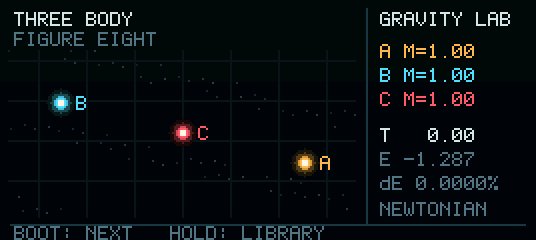
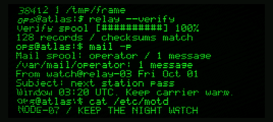
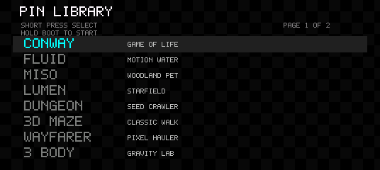
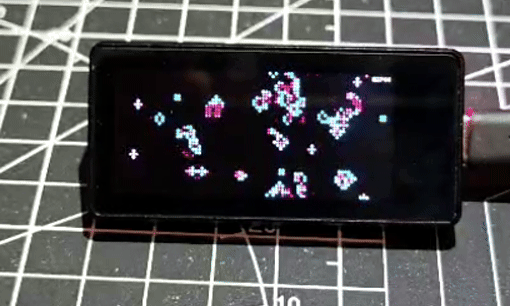

# ESP32 Pin Launcher [](README.md) [](readmes/README.es.md)

[](https://github.com/JuanMHuerta/esp32-pin-launcher/actions/workflows/ci.yml)

Nine games and animated scenes for the Waveshare ESP32-S3-Touch-AMOLED-1.91
(SKU 28596). A small launcher selects which app to boot. Each app runs from its
own flash partition and can return to the launcher with the BOOT button.

The apps work offline. Their graphics and simulations run on the ESP32;
no phone or network connection is required.

## Apps

The app GIFs and launcher menu preview are rendered on the host with firmware C
code. Fluid uses simulated tilt; Miso shows scripted poses and an accelerated
day/night cycle. The Conway recording below was captured from the physical
display.

| Conway | Fluid | Miso |
| --- | --- | --- |
| [](firmwares/conways-pin/README.md) | [](firmwares/fluid-pin/README.md) | [](firmwares/pet-pin/README.md) |
| Game of Life with touch-placed patterns. | Particle-based water simulation driven by motion. | A pet that reacts to touch, tilt and gentle shakes. |

| Lumen | Dungeon | 3D Maze |
| --- | --- | --- |
| [](firmwares/render-pin/README.md) | [](firmwares/dungeon-pin/README.md) | [](firmwares/maze-pin/README.md) |
| A starfield with tilt, rotation and touch controls. | An autonomous first-person dungeon crawl. | A generated maze explored by a wall-following camera. |

| Wayfarer | Three Body | CRT |
| --- | --- | --- |
| [](firmwares/wayfarer-pin/README.md) | [](firmwares/three-body-pin/README.md) | [](firmwares/crt-pin/README.md) |
| A cozy pixel-art cockpit with moody lighting, detailed worlds and passing traffic. | Eight gravitational three-sun encounters across a field of stars. | A scripted terminal with phosphor glow and scanlines. |

Click a preview for the app's controls, implementation and development commands.

## Launcher menu

The menu preview follows the selection through the installed apps and Demo mode.



## On the device

This recording shows Conway's Game of Life running on the Waveshare display.



## Hardware

The supported board has 16 MB flash, 8 MB PSRAM, a 536 × 240 landscape AMOLED,
FT3168 touch and a QMI8658C IMU. The apps use RGB565 and the board's
SH8601-compatible QSPI display path. PSRAM is not required.

Read the [board contract](documentation/AGENTS_WAVESHARE_ESP32S3_TOUCH_AMOLED_1_91.md)
before changing pins, display initialization or sensors. The
[hardware validation ledger](documentation/WAVESHARE_ESP32S3_TOUCH_AMOLED_1_91_VALIDATION.md)
records sources and board-specific observations. SD support uses the configuration
tested on this project's board; confirm the mapping before using another revision.

## Build and install

For browser installation, the [USB web flasher](https://juanmhuerta.github.io/esp32-pin-launcher/)
lets users choose apps and install over USB. The launcher menu and Demo mode
are included and follow the installed selection. The
[flasher guide](documentation/WEB_FLASHER.md) covers local preview and publishing.

Use ESP-IDF **5.5.x**; the dependency locks were generated with **5.5.1**.
Install the ESP32-S3 toolchain using the
[ESP-IDF setup guide](https://docs.espressif.com/projects/esp-idf/en/v5.5.1/esp32s3/get-started/index.html).
The scripts require Bash 5+, Python 3 and the tools provided by ESP-IDF.
Clone the project and activate ESP-IDF:

If you downloaded a source archive, use its extracted directory and skip the
first two commands.

```sh
git clone https://github.com/JuanMHuerta/esp32-pin-launcher.git
cd esp32-pin-launcher
source /path/to/esp-idf/export.sh
./build-and-flash.sh --build-only
./build-and-flash.sh /dev/ttyACM0
```

Replace `/dev/ttyACM0` with your board's serial port. The final command builds,
installs and verifies the launcher and all nine apps, then clears the OTA boot
selection. Reset the board to open the launcher. For ROM download mode, hold
BOOT, press and release RESET, then release BOOT.

The script generates `partitions.csv` from the built image sizes. Each image
gets the minimum contiguous allocation in 64 KiB blocks. Offsets can move when
an image grows, so install the partition table and all images together after a
layout change. An app's standalone `idf.py flash` installs a different partition
table; use the root script for this collection.

Inspect the current allocation with:

```sh
python3 tools/app_layout.py check --compiled
```

## Launcher controls

Tap BOOT to select the next entry. Hold it for 0.7 seconds, then release, to
start the selected app. In an app, hold BOOT for 1.5 seconds and release to
return to the launcher.

USB Serial/JTAG provides the same selection:

| Command | App | Partition in the full collection |
| --- | --- | --- |
| `1` | Conway | `ota_0` |
| `2` | Fluid | `ota_1` |
| `3` | Miso | `ota_2` |
| `4` | Lumen | `ota_3` |
| `5` | Dungeon | `ota_4` |
| `6` | 3D Maze | `ota_5` |
| `7` | Wayfarer | `ota_6` |
| `8` | Three Body | `ota_7` |
| `9` | CRT | `ota_8` |
| `D` | Demo: each installed app runs for five minutes, repeating | — |

Holding BOOT in Demo stops the rotation and returns to the launcher.
With a browser-selected collection, only installed apps appear in the menu.
USB shortcuts retain the identities above; omitted apps are ignored.
Browser selections assign consecutive OTA subtypes to the installed apps.

## Development

Host tests need a C compiler, Make, Python **3.10+** and Pillow. Preview tools
also use FFmpeg where noted. Install the Python and formatting tools in a virtual
environment:

```sh
python3 -m venv .venv
source .venv/bin/activate
python -m pip install -r requirements-dev.txt
./tools/test.sh
```

The tests exercise every app's portable simulation and rendering code, shared
graphics, flash allocation and the SD host client. They do not require a board.
Use `./tools/test.sh --app maze-pin` for one app, or `--soak` to include Fluid's
two 30-minute simulated runs. `SANITIZERS=address,undefined ./tools/test.sh`
enables runtime checks when your compiler provides those libraries.

See [CONTRIBUTING.md](CONTRIBUTING.md) for the source layout, formatting,
preview generation and hardware checks. Historical device measurements are
kept in [validation records](documentation/README.md); their old offsets are
not installation instructions.

## SD file access

While the launcher is running, `tools/sdcard.py` can manage a FAT-formatted
microSD card over USB Serial/JTAG. Apps do not expose this service. The launcher
never formats a card automatically. The client requires pyserial.

```sh
python3 tools/sdcard.py --port /dev/ttyACM0 info
python3 tools/sdcard.py --port /dev/ttyACM0 list /
python3 tools/sdcard.py --port /dev/ttyACM0 put assets /assets
python3 tools/sdcard.py --port /dev/ttyACM0 get /assets ./downloaded-assets
```

The [SD file guide](documentation/SD_CARD_FILE_TOOL.md) describes all commands,
path limits and the binary protocol.

## License

Project code, documentation and artwork are licensed under the
[GNU General Public License v3.0](LICENSE), `GPL-3.0-only`.
Copyright © 2026 ESP32 Pin Launcher contributors.
Third-party dependencies retain their own licenses; see [NOTICE.md](NOTICE.md).
