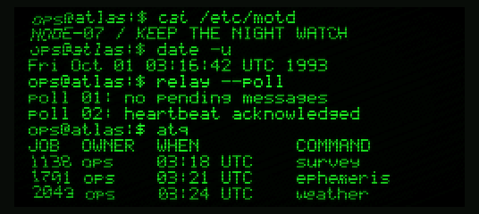

# CRT / ATLAS VT-220

A fictional orbital station boots and logs in once, then keeps its Unix-style
console running indefinitely. An 817-event playlist lasts about 5 minutes
18 seconds before repeating, with six continuous workflows:

- **Station operations:** processes, memory, disk usage, network configuration,
  logs, spool synchronization, survey jobs, priority mail, and watch messages.
- **Maintenance:** disk and memory diagnostics, serial handshake checks,
  retransmissions, watchdog and clock failover, ROM checks, and fault records.
- **Relay telemetry:** frequency scanning, antenna tracking, packet reception,
  CRC retries, sensor history, carrier dropouts, buffered handoffs, and weather.
- **Network diagnostics:** routes, packet traces, buffer statistics, loopback,
  multihop probes, route simulations, priority traffic, and keepalives.
- **Archives:** file manifests, checksums, compression, block transfers,
  remote receipts, retention checks, parity scrubs, and mirrored block repair.
- **Signal diagnostics:** spectrum readings, gain and frequency correction,
  orbital tracks, I/Q samples, interference suppression, and calibration.

Live ASCII carrier traces animate in place during surveys, clock checks,
handoffs, and receiver diagnostics. Quiet sci-fi references are tucked into
station tags, job numbers, component labels, and archived records.

Commands type at roughly 55 characters per second. Output arrives in short
bursts with pauses for reports, warnings, and progress bars. Playlist boundaries
retain the visible scrollback: there are no automatic restarts or power-downs.
Commands and readings are scripted fiction; they do not execute a shell or
access the board's storage, network, or sensors.

Each launch or manual restart randomly chooses green or amber phosphor and
keeps that single hue for the entire session, including warnings and glow.
Green has a slight neutral tint to soften its saturation. The terminal uses
the original font size with 39 columns and twelve rows. The text uses the full height of the glass.
Scanlines, tight and soft text bloom, curved glass, edge attenuation,
fine phosphor grain, a slow refresh band, slight line wobble, and a blinking
block cursor give the old CRT appearance. A thin neutral gray bezel frames
the glass.
The short power-on expansion runs only when the console is explicitly restarted.

Tap **BOOT** to restart at the next workflow and choose a fresh phosphor color
(the random choice may repeat). Hold **BOOT for 1.5 seconds**, then release it,
to return to the launcher. Select CRT with USB command **9** or the launcher's
second page. Its image occupies `ota_8`; the current offset and minimum 64 KiB
block allocation are generated in the root `partitions.csv`.

Playback advances by event time, so typing, progress, and scrolling stay
consistent across different frame rates. A 64-bit session clock avoids replaying
startup after the 32-bit millisecond boundary. The fixed 39-column, 12-row
terminal does not allocate during playback. The shared landscape QSPI adapter
expands a 268×120 RGB565 scene to 536×240 using DMA double buffers.
PSRAM and SD storage are not required.

From the repository root:

```sh
tools/test_scenes.sh
python3 tools/preview_scene.py crt-pin --preset 0 --start 44 --seconds 14
source /path/to/esp-idf/export.sh
idf.py -C firmwares/crt-pin build
```

Host tests check every scripted glyph, command completion, progress,
row/column bounds, animated traces, text in the recovered footer space,
retained scrollback across all six boundaries, hundreds of
continuous playlist loops, time-step agreement, manual restarts, both monochrome
themes, and renderer buffer boundaries. Set `SANITIZERS=address,undefined` when
the host provides those runtimes. Preview presets **0–5** select the workflows
above; previews use deterministic green for even presets and amber for odd ones.
The device chooses its color independently from the workflow.

With the factory launcher running, check actual USB launch and sustained
playback using:

```sh
python3 tools/check_app.py crt-pin --seconds 360 --all-profiles
```

The hardware check requires the launcher at startup; it launches the app,
observes all six workflows, and checks for crashes, low frame rate, and heap drift.
Use the root `build-and-flash.sh` for the launcher layout; standalone app
`idf.py flash` would install its standalone partition table.



Animated previews: [station operations](preview-0.gif),
[maintenance in amber](preview-1.gif), [relay telemetry](preview-2.gif),
[network diagnostics](preview-3.gif), [archives](preview-4.gif),
[signal diagnostics](preview-5.gif). These use the device's actual C renderer.
