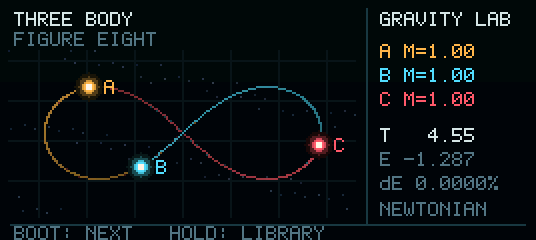

# THREE BODY / Gravity Lab

Three luminous suns gravitate around each other on a dark observatory display.
Amber, cyan, and crimson trails show each body's recent path. The camera eases
its zoom to follow the system; the sidebar shows mass, simulated time, total
energy, and relative energy drift.

The app cycles through three scenarios every 45 seconds:

- **Figure eight:** three equal point masses chase a periodic orbit. This uses
  the published [Simó initial conditions](https://people.ucsc.edu/~rmont/Nbdy/NbdyB.html)
  with Newtonian gravity, G=1, and no softening.
- **Chaotic suns:** unequal masses exchange energy through close encounters.
- **Binary visitor:** a lighter third sun approaches an orbiting pair.

The latter two scenarios use Plummer softening (0.04 and 0.025 world units) to
regularize close encounters. This is an illustrative, planar gravitational
simulation inspired by the book's three suns. It does not reproduce the book's
fictional planetary climate or model relativistic effects. Bodies are integrated
with fourth-order Runge–Kutta and encounter-dependent steps bounded by free-fall
and crossing times. There are no scripted paths, screen-wall reflections, or
artificial orbit confinement. Escaping bodies cause the camera to zoom out.

Tap **BOOT** to move to the next scenario. Hold **BOOT for 1.5 seconds**, then
release it, to return to the launcher. Select the app with USB command
**8** in the launcher. Its image occupies `ota_7`; the current
offset and minimum 64 KiB block allocation are generated in the root `partitions.csv`.

The display uses the existing Waveshare landscape QSPI initialization and
SH8601-compatible driver. A 268×120 RGB565 scene is expanded to 536×240 with
internal DMA double buffers. Neither PSRAM nor SD storage is required.

From the repository root:

```sh
tools/test_scenes.sh
python3 tools/preview_scene.py three-body-pin --preset 0 --seconds 14
source /path/to/esp-idf/export.sh
idf.py -C firmwares/three-body-pin build
```

The host tests check one-period return for the figure eight, conservation of
energy and momentum through all full-length scenarios, finite camera zoom,
automatic switching, framebuffer boundaries, and display expansion/byte order.
Set `SANITIZERS=address,undefined` when the host provides those runtimes.

With the factory launcher running, check actual USB launch and sustained
playback using:

```sh
python3 tools/check_app.py three-body-pin --seconds 140 --all-profiles
```

The hardware check requires the launcher at startup; it launches the app,
observes all three scenarios, and checks for crashes, low frame rate, heap drift
and excessive energy drift.

Use the root `build-and-flash.sh` to flash the multi-app layout. A app's
standalone `idf.py flash` uses its standalone partition table, so it is unsuitable
for adding just this image to an already-installed launcher.



Animated previews: [figure eight](preview-0.gif), [chaotic suns](preview-1.gif),
[binary visitor](preview-2.gif). These are generated by the firmware's C renderer.
